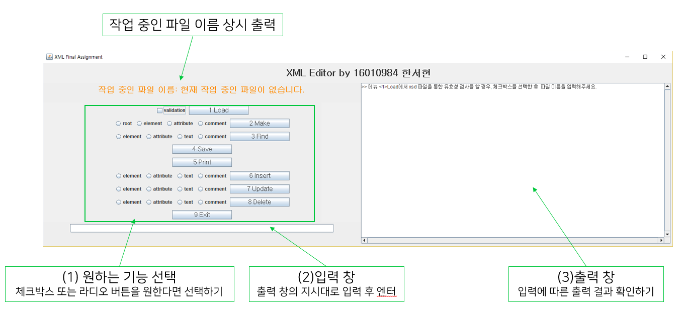

# XML-Editor-Project-2018-2
XML Editor Project with GUI

## XML Editor의 기능

1. Load
2. Make
3. Find
4. Save
5. Print
6. Insert
7. Update
8. Delete
9. Exit

## 실행 방법

- XML01_HW5_16010984 > XML01_HW5_16010984 java project > src > XML01_HW5_16010984.java

자세한 설명은 XML01_HW5_16010984 > XML01_HW5_16010984.docx 파일에 있습니다.

## 그 외
- xml: 네이버 웹툰을 주제로 제가 임의로 만든 데이터 입니다.
- xsd: xml 스키마입니다.
- xsl: xml을 브라우저에서 이쁘게 보여줍니다.
